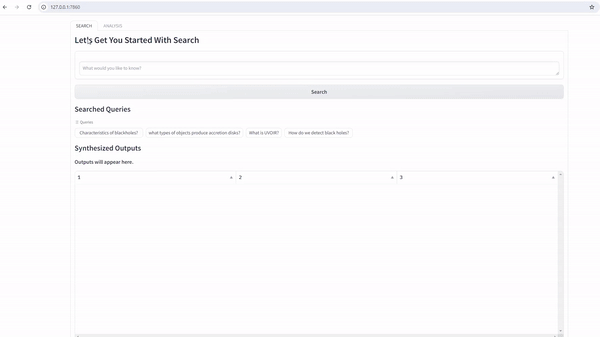

<div align="center">

# Retriever

### Visually search and analyze your documents, entirely locally.

<p>


</p>

</div>

## Install 
Options:
1) Install with pip (Stable Release)
```
$ pip install retriever-search
```
2) Install from Github Repo (Latest Release)
```
$ git clone https://github.com/GovML/retriever.git
$ pip install -e .
```
We recommended using a virtual environment for all dependency installations. Before installing our repo, you can use venv to isolate the various packages installed in this environment to prevent conflicts with versions already installed on your computer.

```
$ python -m venv new_env
$ source new_env/bin/activate
```

## Quickstart - Launching Retriever
Retriever is composed of two parts that you'll need to launch.
1) **Backend:** The backend server ingests and returns search results. This server is exposed locally via Flask.
2) **Frontend:** The frontend is the user interface (UI) you use to input searches and visualize your results. The frontend sends requests to the backend server.

First you'll need to ensure you have a folder of PDFs on your computer. If you don't have PDFs handy, we've provided a script under [tutorials](tutorials/download_examples.py) to download a few example papers from arXiv.

Once you have your folder of PDFs, you can start up the **backend** search server by opening up a terminal window and running:

```
>>> from retriever_search import search_server
>>> search_server.run_search_server('./pdfs_folder/', json_save_path='save_results.json', device='cpu')
```
*If your computer has a CUDA compatible GPU, you can change* ```device='cuda'``` *or if you are on mac,* ```device='mps'```

Next, open up a second terminal window and run the following:
```
>>> from retriever_search import frontend_app as fp
>>> fp.run_frontend()
```
Retriever should be up and running! You can access the UI at the following port on your computer: http://127.0.0.1:7860.
This URL would work for your local setup only (paste the url into your browser which can render the UI, but you won't need an external internet connection to use it).

Next time you run Retriever, you can call it directly on the json you just saved your pdfs to in order to save time!
```search_server.run_search_server(input_json='save_results.json', device='cpu')```

## Full Parameter Guide for Search server
```
>>> search_server.run_search_server('input_directory', 'input_json', 'json_save_path', 'embedding_model', 'qa_model', device='cpu')
```
#### Search parameter definitions
- input_directory -- The directory holding your files
- input_json -- pre saved json file from earlier runs can be used for faster loading
- json_save_path -- pass for saving the embeddings to a json can be used later as input_json
- embedding_model -- pick the embedding model you want to we use Spectre model as a default
- qa_model -- you can currently pick between tiny, medium and large

## Tickets

1.1.0
- [ ] Make LDA visualization update
- [ ] QA Model Improvements
- [ ] Add support for HTML, txt

1.0.2
- [x] Add Quickstart

